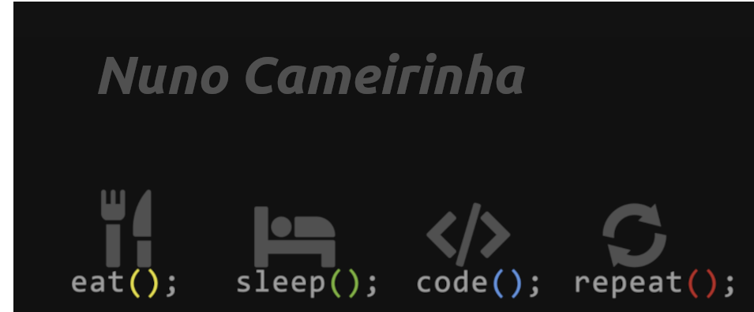

## Hi Welcome to my github!  

I´ve started my career in Audiovisuals as Lighting operator wich is an area that I loved and where we need to automate some tasks of intelligent lights such as Moving heads. 
But since the beggining of the pandemic I've seen a big shutdown of the shows(where I work) and consecutively my income as an Audiovisual Freelancer, so I saw an advertisement of [42 Lisboa](https://www.42lisboa.com/en/) at the street and I decided that this is the way I want to go to! In the same way as an Lighting operator, logic is a must have for the professional, in Programming is a important point too. 
My first contact with programming(C language) was when I am around 17yo and started buying  Arduino with a lot of components and started trying to assemble all of them and burning other ones (connecting it in a wrong way). 
Early I discover that internet its a very good source of knowledge for all the areas and I started looking for contents about C and how can I transform it into a Real life project such as a controller for lights, motors, small displays, through bluetooth, with I.R. remotes, radio ,etc.. things that usually we use daily and how can we use it to do some specific tasks using programming. 
Until I get into 42 Lisboa I never imagine that I can work in IT area, but now I feel that with peer2peer learning model used in 42 and all the challenges I found on the projects I feel more confident and I think that I will prepared to go through all the different challenges that IT area offers to his professionals. 

## Languages and Tools

## Github Stats

<table><tr><td valign="top" width="50%">

</td><td valign="top" width="50%">

</td></tr></table>

 

---
